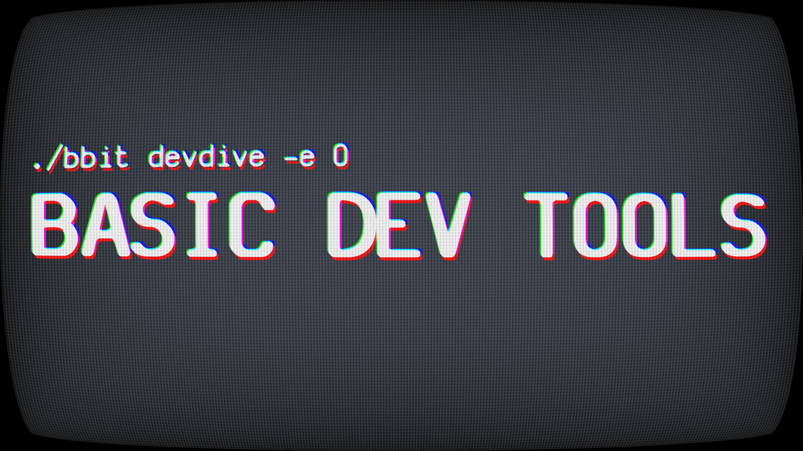

# 1. Packaging

## Title

### Ideas

- `3 basic developer tools`
- `3 basic development tools`
- `3 basic tools for developers`
- `3 tools you NEED as a DEVELOPER`
- `You NEED these tools`
- `You NEED these 3 tools`
- `You NEED 3 tools as a DEVELOPER`

### Final 4

1. `3 tools you NEED as a DEVELOPER`
2. `You NEED 3 tools as a DEVELOPER`
3. `You NEED these 3 tools`
4. `3 basic tools for developers`

## Thumbnail

### Ideas

_This is where you drop all the thumbnail ideas you have from other creators or other sources_

[Tool to get existing YouTube video thumbnails](https://www.get-youtube-thumbnail.com/)

### Sketches

_Make as many sketches on paper, phone, tablet, or computer as you want to come up with your own ideas_

### Final 4

## Test T&T Combination

[Use the website below to test thumbnail and title combinations](https://thumbsup.tv/)
