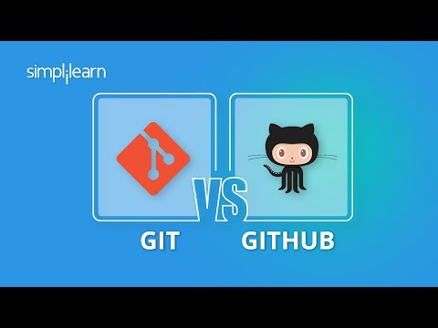

# 1. Packaging

## Title

### Ideas

- `Git & Github: Get Started`
- `Master Git & Github`
- `Why YOU should learn Git & Github`
- `You MUST use Git & Github`
- `Git & Github for dummys`
- `Git & Github for anyone`
- `Git & Github for anyone (yes, YOU)`
- `Version control explained`
- `Version control made easy`

### Final 4

1. `Why YOU should learn Git & Github`
2. `Simple intro to Git & Github`
3. `You MUST use Git & Github`
4. `Git & Github made easy`

## Thumbnail

### Ideas

[Tool to get existing YouTube video thumbnails](https://www.get-youtube-thumbnail.com/)

### Sketches

_Make as many sketches on paper, phone, tablet, or computer as you want to come up with your own ideas_

### Final 4

_Drop all final versions you made here. Make at least 4_

## Test T&T Combination

[Use the website below to test thumbnail and title combinations](https://thumbsup.tv/)
