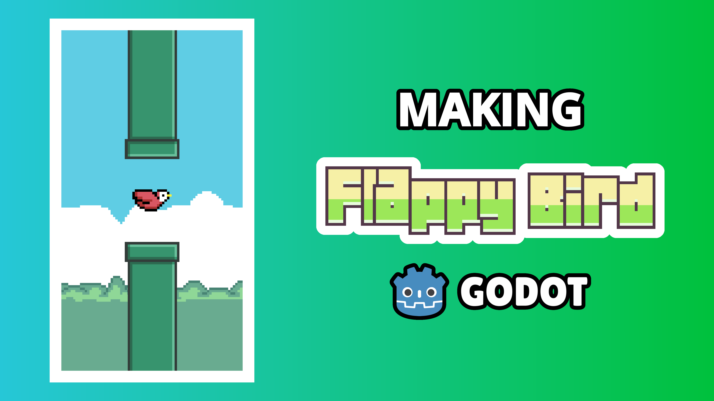
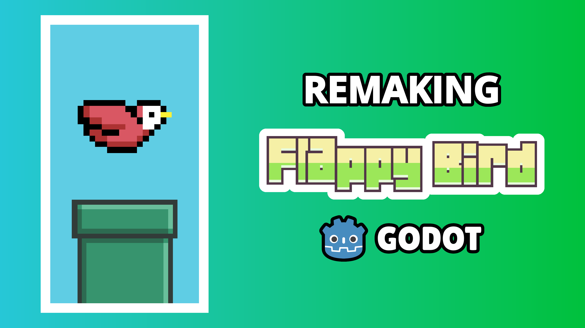
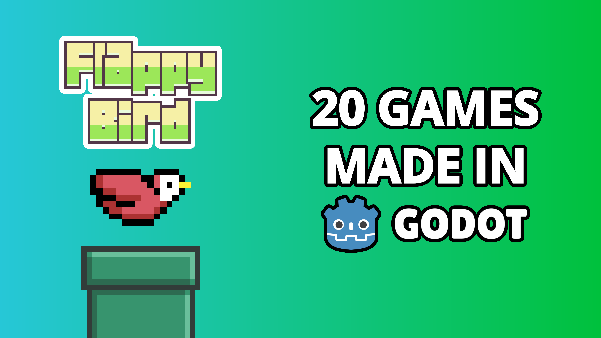

# 1. Packaging

## Title

### Ideas

- `How I made Flappy Bird in Godot`
- `I made Flappy Bird in Godot`
- `Making Flappy Bird in Godot`
- `Learning Godot by making Flappy Bird`
- `Make your first game: Flappy Bird`
- `How to make Flappy Bird in Godot`
- `Recreate Flappy Bird`
- `Recreating Flappy Bird`
- `Recreating Flappy Bird in Godot`

### Final 4

- `How I made Flappy Bird in Godot`
- `I made Flappy Bird in Godot`
- `Making Flappy Bird in Godot`

## Thumbnail

### Ideas

[Tool to get existing YouTube video thumbnails](https://www.get-youtube-thumbnail.com/)

### Sketches

### Final 4

## Test T&T Combination

[Use the website below to test thumbnail and title combinations](https://thumbsup.tv/)
