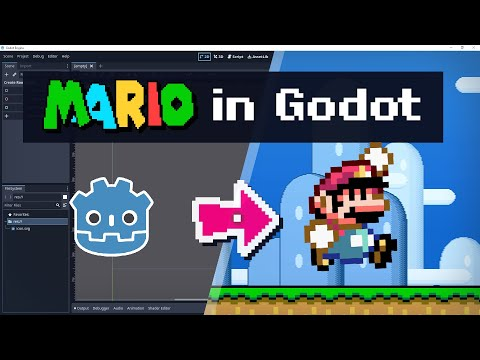
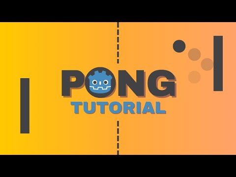
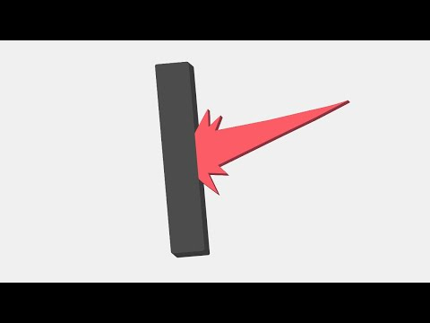
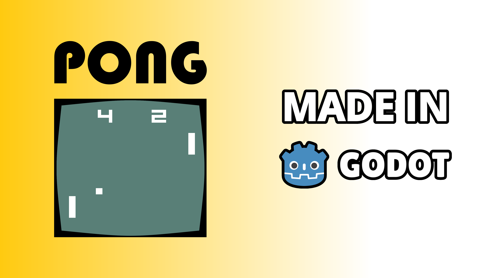
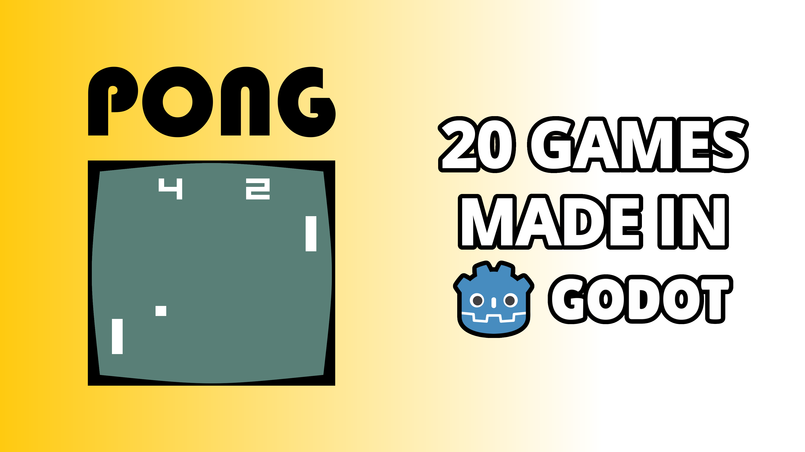

# 1. Packaging

## Title

### Ideas

- `Learning Godot by making Pong`
- `Make your first game: Pong`
- `I made Pong in Godot`
- `How to make Pong in Godot`
- `Recreate Pong`
- `Recreating Pong`
- `Recreating Pong in Godot`

### Final 3

- `How I made Pong in Godot`
- `I made Pong in Godot`
- `Making Pong in Godot`

## Thumbnail

### Ideas

[Tool to get existing YouTube video thumbnails](https://www.get-youtube-thumbnail.com/)

### Sketches

### Final 3

## Test T&T Combination

[Use the website below to test thumbnail and title combinations](https://thumbsup.tv/)
